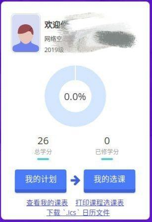
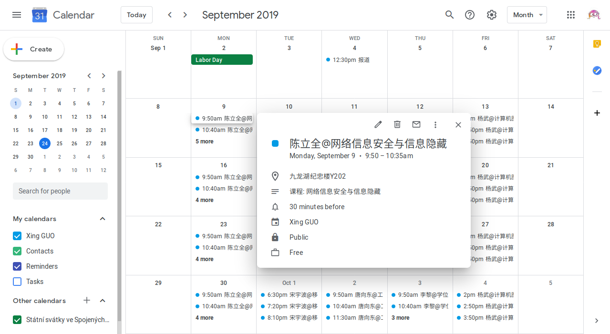
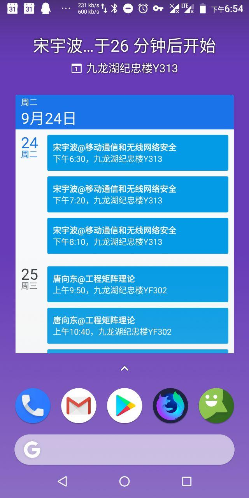

### seu-master-course-exporter

> 一个用来将东南大学硕士课程导出为 `.ics` 日历文件的 Chrome/Chromium 插件

#### How to use

1. 下载这个插件包
2. 打开 `chrome://extensions/`
3. 允许 `Developer Mode`
4. 选择 `Load upacked`
5. 打开选课页面
6. 点击 "下载 `.ics` 日历文件"
7. 导入到任意日历应用 (`Google Calendar` 等)，具体导入步骤请参考 [Wiki](https://github.com/vgxbj/seu-master-course-exporter/wiki)
8. Star 这个项目

#### Example

